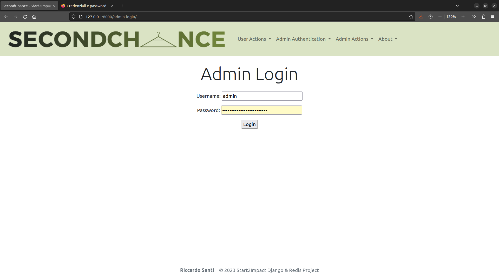
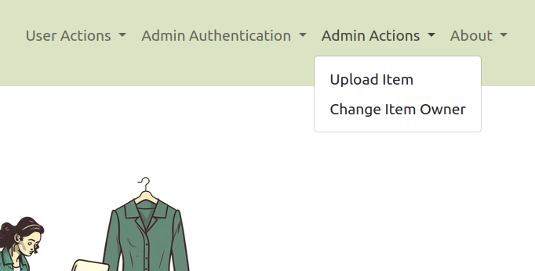
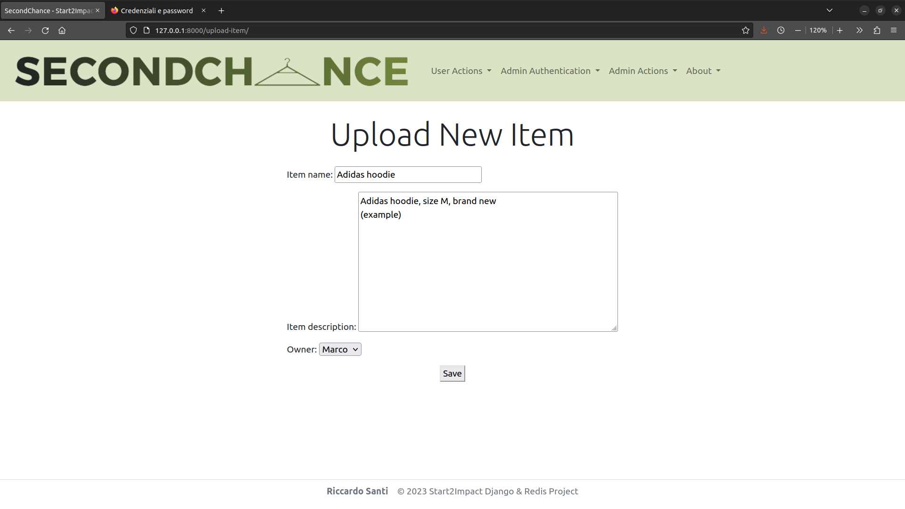
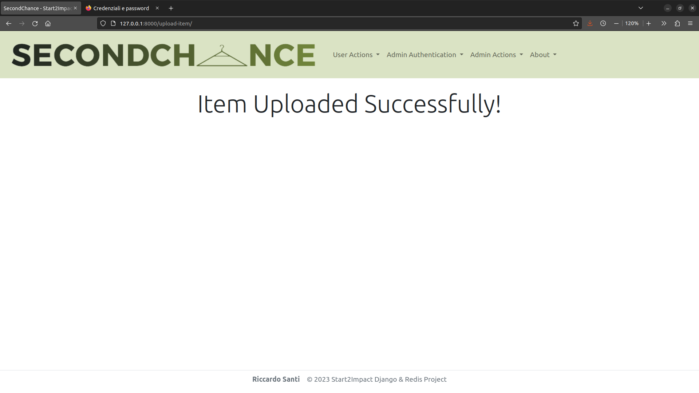
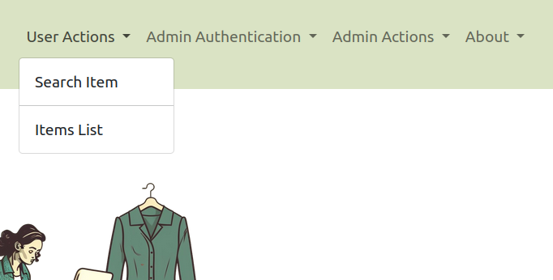
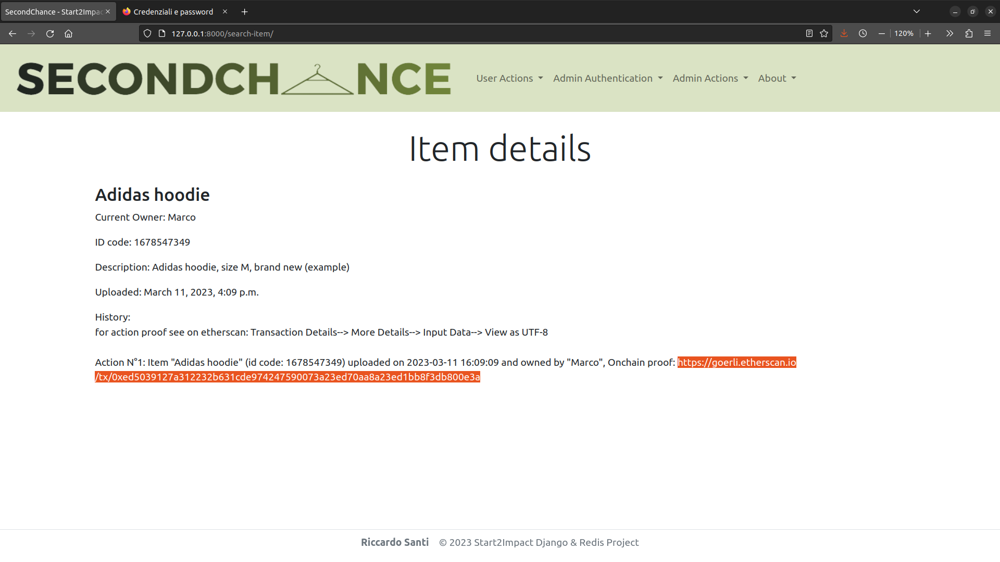
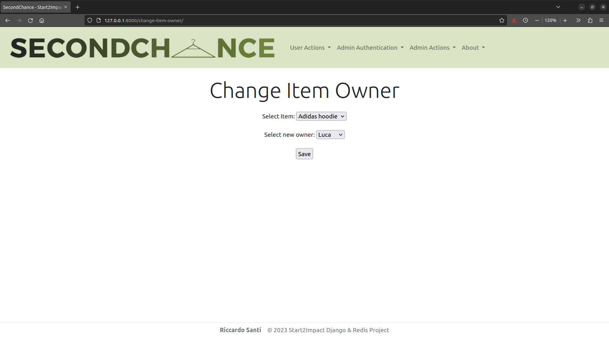
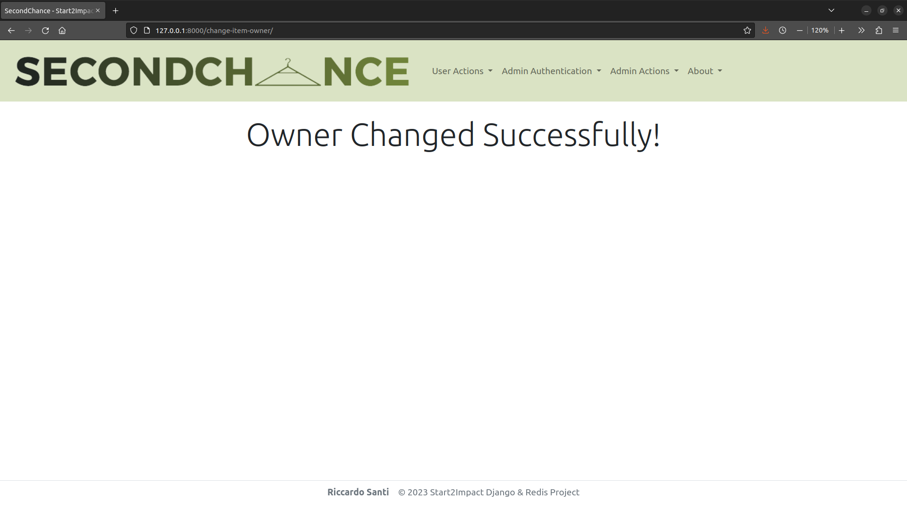
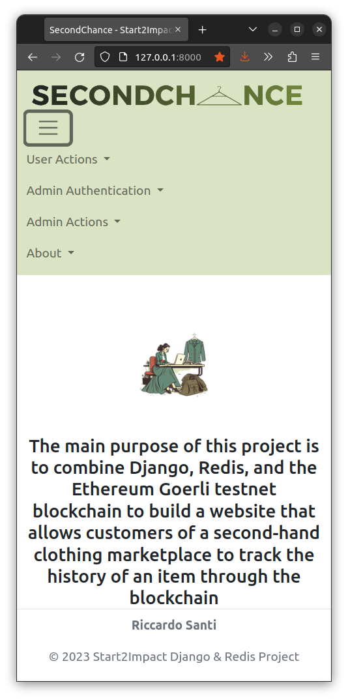

# Start2Impact Django & Redis Project

    

### The main purpose of this project is to combine __Django__, __Redis__, and the __Ethereum Goerli testnet blockchain__ to build a website that allows customers of a second-hand clothing marketplace to track the history of an item through the blockchain.

SecondChance is a __Proof of Concept__, an exercise focused on determining if an idea can be turned into a reality or not. For this reason, it covers only the item transaction on-chain proof and should be connected to an online marketplace to be used in a real situation. 
 
If implemented correctly together with a second-hand marketplace, SecondChance could lead to several advantages such as __enhanced transparency__, __increased trust__ between buyers and sellers, and a more __sustainable fashion industry__.

## Main Features:

- A website homepage with a brief explanation of the project

    

- A section where administrators can create a new account and log into the platform

    
    
    
    

- A page where administrators only can upload a new clothing item

    
    
    
    

- A page where anyone can see all the items uploaded on the website and their leading information

    
    

- A page where anyone can enter an ID code of a specific item and see its past transactions provided with the blockchain proof 

    
    
    

- A page where administrators can change an item's owner

    
    
    
    

- A function that alerts administrators when logging into the platform with a different IP address

    

- The ability to adapt the website page and content to different types of devices to allow users to have always the best experience

    

## How to deploy

- Download the repository file 
- Be sure to have Python installed on your device, for this project i used Python 3.10.6.
- Be sure to have a Python IDE on board (I recommend [PyCharm](https://www.jetbrains.com/pycharm/)).
- Open the program file in your IDE and create a virtual environment.
- Install program requirements by typing `pip install -r requirements.txt` in a new terminal window.
- Update the program database by typing `cd Progetto`, `python3 manage.py makemigrations` and `python3 manage.py migrate`.
- Run the program by typing `python3 manage.py runserver`.
- Check that Redis is correctly working by typing `redis-cli ping` in a new terminal window: if the response is something like `PONG`, you're ready to enjoy SeconChance, just open [http://127.0.0.1:8000/](http://127.0.0.1:8000/) in your browser.
- Otherwise, if the response  looks something different from `PONG`, most times it's because Redis just didn't start automatically so do it manually by typing `redis-server`.

## Improved Skills
Python, Django, Redis, Etherum Goerli Testnet, HTML and Boostrap CSS
